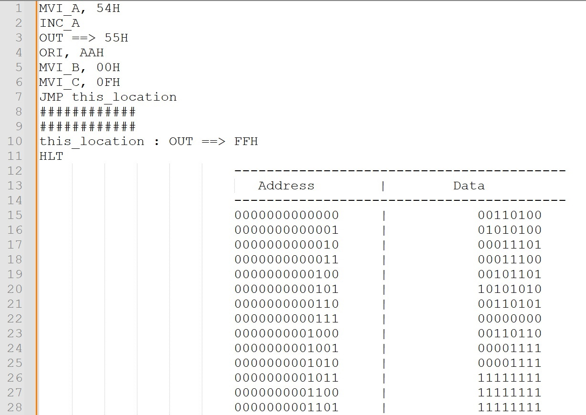

# Designed A CPU using ALTERA FPGA & Verilog HDL.
# This is the Architecture.
.jpg)
# This are the Full Instruction set of my CPU.

# [Click Here to See the Full Instruction Set](Program/instruction_set.txt)
# These are some instructions written by the user.

# [Click Here to See the Full ASM Code](Program/Program_asm.txt)
# After converting this code to binary and put it into the EEPROM.

# It will start to execute.
# This is the Picture of the FPGA Board while it Executing this instructions.

# Data Port and Flag Register.

# This is the Full Circuit Configuration.

# [Please see the codes for better understanding.](Program/CPU_Design.v)

https://github.com/shuvabratadey/FPGA-CPU-Design/assets/20286896/8216a96e-d70c-4e75-8fc6-9356e11e7fb1

# YouTube Link:- https://youtu.be/it-jdhMR7sY
